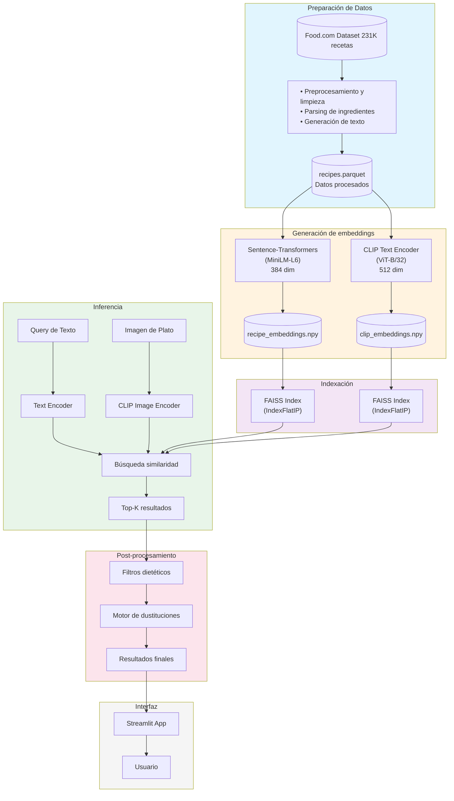
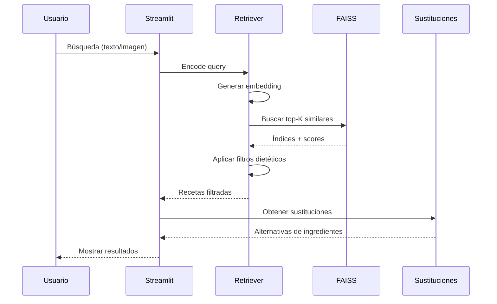

# 🍳 Motor de búsqueda multimodal de recetas

Sistema de búsqueda de recetas que combina procesamiento de lenguaje natural y visión por computadora para encontrar recetas por texto, ingredientes o imágenes, con filtros dietéticos inteligentes y sustituciones de ingredientes.

##  Características

-  **Búsqueda semántica**: Búsqueda sobre 231K recetas usando embeddings de texto
-  **Búsqueda por imagen**: Sube fotos de platos para encontrar recetas similares usando CLIP
-  **Filtros dietéticos**: Vegetariano, vegano, sin gluten, sin lácteos
-  **Sustituciones inteligentes**: Sugerencias de ingredientes alternativos según preferencias dietéticas
-  **Retrieval rápido**: Búsqueda en milisegundos usando índices FAISS
-  **Tracking MLOps**: Experimentos registrados en MLflow/Databricks

##  Arquitectura del sistema


## Pipeline de procesamiento


##  Estructura del proyecto
```
CEIA-VIT/
├── app/                              # Interfaz Streamlit
│   ├── streamlit_app.py             # App principal
│   ├── strings_es.py                # Traducciones al español
│   ├── components/                  # Componentes UI reutilizables
│   └── assets/                      # Imágenes, CSS
│
├── src/                             # Código fuente principal
│   ├── data/                        # Preprocesamiento de datos
│   │   ├── preprocessing.py         # Limpieza y preparación de recetas
│   │   └── dietary_tagger.py        # Clasificación dietética
│   │
│   ├── models/                      # Modelos de embeddings y retrieval
│   │   ├── embeddings.py            # Sentence-transformers embeddings
│   │   ├── clip_embeddings.py       # CLIP embeddings multimodales
│   │   ├── retrieval.py             # Sistema de búsqueda por texto
│   │   └── clip_retrieval.py        # Sistema de búsqueda por imagen
│   │
│   ├── substitutions/               # Motor de sustituciones
│   │   ├── rules.py                 # Lógica de sustituciones
│   │   └── substitution_db.json     # Base de datos de sustituciones
│   │
│   ├── evaluation/                  # Scripts de evaluación
│   │   ├── hard_negatives.py        # Tests de negativos difíciles
│   │   ├── clip_image_tests.py      # Tests de pares confusos
│   │   ├── model_comparison.py      # Comparación MiniLM vs CLIP
│   │   └── vision_model_comparison.py # Comparación modelos de visión
│   │
│   └── utils/                       # Utilidades
│       ├── config.py                # Configuración de rutas
│       ├── device.py                # Manejo de GPU/CPU/MPS
│       └── mlflow_logger.py         # Logging a MLflow/Databricks
│
├── data/                            # Datos (gitignored)
│   ├── raw/food-com/               # Dataset original Food.com
│   ├── processed/                   # Recetas preprocesadas
│   └── embeddings/                  # Embeddings y índices FAISS
│
├── experiments/                     # Resultados de experimentos
│   ├── comparison_charts/           # Gráficos comparación de modelos
│   └── vision_comparison/           # Gráficos comparación visión
│
├── notebooks/                       # Jupyter notebooks para exploración
├── configs/                         # Archivos de configuración
├── mlruns/                         # Experimentos MLflow locales
└── tests/                          # Tests unitarios
```

##  Instalación

### Requisitos
- Python 3.10+
- GPU recomendada (funciona en CPU/MPS también)
- ~4GB de espacio en disco para datos y embeddings

### Pasos

1. **Clonar el repositorio**
```bash
git clone <repo-url>
cd CEIA-VIT
```

2. **Crear entorno virtual e instalar dependencias**
```bash
python -m venv .venv
source .venv/bin/activate  # En Windows: .venv\Scripts\activate

pip install -r requirements.txt
```

3. **Descargar el dataset Food.com**
```bash
# Requiere Kaggle API configurada
cd data/raw/food-com
kaggle datasets download -d shuyangli94/food-com-recipes-and-user-interactions
unzip food-com-recipes-and-user-interactions.zip
rm food-com-recipes-and-user-interactions.zip
cd ../../..
```

4. **Configurar variables de entorno (opcional para Databricks)**
```bash
# Crear .env en la raíz del proyecto
cat > .env << EOF
DATABRICKS_HOST=https://tu-workspace.cloud.databricks.com
DATABRICKS_TOKEN=tu_token_de_acceso
DATABRICKS_USER=tu.email@dominio.com
EOF
```

##  Pipeline de datos

### 1. Preprocesamiento
```bash
python src/data/preprocessing.py
```
- Limpia y estructura 231K recetas
- Genera texto enriquecido para embeddings
- Registra métricas en MLflow

### 2. Crear embeddings (Sentence-Transformers)
```bash
python src/models/embeddings.py
```
- Modelo: `sentence-transformers/all-MiniLM-L6-v2`
- Genera embeddings de 384 dimensiones
- ~20 segundos en GPU RTX 5090

### 3. Crear embeddings CLIP (Multimodal)
```bash
python src/models/clip_embeddings.py
```
- Modelo: `openai/clip-vit-base-patch32`
- Genera embeddings de 512 dimensiones
- Permite búsqueda por imagen

##  Uso

### Abrir la aplicación Web
```bash
streamlit run app/streamlit_app.py
```

La app se abrirá en `http://localhost:8501` con tres modos de búsqueda:

1. ** Búsqueda por imagen**: sube una foto de un plato
2. ** Búsqueda por texto**: describe lo que buscas
3. ** Búsqueda por ingredientes**: lista ingredientes disponibles

##  Resultados de evaluación

### Comparación de modelos de texto vs multimodal

| Métrica | MiniLM-L6 | CLIP-ViT-B32 | Ganador |
|---------|-----------|--------------|---------|
| **Accuracy@1** | 0.850 | 0.850 | Empate |
| **Accuracy@5** | 0.750 | **0.900** | CLIP |
| **Accuracy@10** | 0.850 | 0.850 | Empate |
| **Ingredient Match@5** | 0.800 | **0.850** | CLIP |
| **Name Relevance@5** | **0.883** | 0.738 | MiniLM |
| **Avg Similarity@5** | 0.720 | **0.844** | CLIP |
| **Latencia** | 17.3ms | **14.6ms** | CLIP |

### Comparación de modelos de visión

| Modelo | Dimensión | Accuracy@5 | Velocidad (recetas/s) | Latencia |
|--------|-----------|------------|----------------------|----------|
| **CLIP-ViT-B/32** | 512 | **100%** | **5055** | 4.2ms |
| **CLIP-ViT-L/14** | 768 | 94% | 2470 | 5.4ms |

### Hallazgos Clave

1. **CLIP gana en general**: Mejor accuracy@5, matching de ingredientes, scores de confianza más altos, Y más rápido
2. **MiniLM es mejor en relevancia de nombres**: Mejor para hacer coincidir palabras de la query directamente con nombres de recetas
3. **CLIP-ViT-B/32 vs L/14**: El modelo más pequeño (B/32) sorprendentemente supera al más grande en este dominio
4. **Ambos son rápidos**: Búsqueda sub-20ms sobre 231K recetas

### Tests de Negativos Difíciles
```
Test: Chocolate cake should return cakes, not cookies     ✓ PASS
Test: Carbonara should not return other Italian dishes    ✓ PASS  
Test: Vegetarian burger should have no meat               ✓ PASS
Test: Gluten-free bread should not have regular flour     ✗ FAIL*
Test: Vegan dessert should have no animal products        ✗ FAIL*

Pass Rate: 60% (3/5)
```
*Los fallos se deben a tags dietéticos inconsistentes en el dataset, no al modelo.

##  Ejecutar Evaluaciones
```bash

# Tests de hard negatives
python src/evaluation/hard_negatives.py
python src/evaluation/hard_negatives.py --clip

# Comparación MiniLM vs CLIP
python src/evaluation/model_comparison.py

# Comparación de modelos de visión (variantes de CLIP)
python src/evaluation/vision_model_comparison.py --max-recipes 50000
```

##  Visualizaciones generadas

El sistema genera automáticamente las siguientes visualizaciones:

### Comparación de modelos
- `accuracy_at_k_comparison.png` - Gráfico de barras Accuracy@K
- `ingredient_match_comparison.png` - Coincidencia de ingredientes
- `similarity_distribution.png` - Distribución de scores de similaridad
- `search_time_comparison.png` - Boxplot de latencia
- `radar_comparison.png` - Gráfico radar multidimensional
- `summary_table.png` - Tabla resumen

### Comparación de visión
- `vision_accuracy_at_k.png` - Accuracy por modelo de visión
- `vision_embedding_speed.png` - Velocidad de embedding
- `vision_model_characteristics.png` - Características de modelos
- `vision_summary_table.png` - Tabla resumen de visión

##  Stack tecnológico

| Categoría | Tecnología |
|-----------|------------|
| **Embeddings de texto** | Sentence-Transformers (MiniLM-L6-v2) |
| **Embeddings multimodales** | CLIP (ViT-B/32, ViT-L/14) |
| **Búsqueda vectorial** | FAISS (Facebook AI Similarity Search) |
| **Interfaz web** | Streamlit |
| **MLOps** | MLflow + Databricks |
| **Procesamiento de datos** | pandas, NumPy |
| **Deep Learning** | PyTorch (con soporte CUDA/MPS/CPU) |

##  MLflow/Databricks

El pipeline registra automáticamente:
- Estadísticas de preprocesamiento
- Métricas de embeddings (tiempo, dimensión, throughput)
- Resultados de evaluación (precision, recall, contamination rate)
- Artefactos (gráficos de comparación)

Para ver experimentos localmente, ejecutar:
```bash
mlflow ui
# Abre http://localhost:5000
```

O en Databricks (si está configurado):
- Los experimentos aparecen en **Machine Learning → Experiments**


##  Trabajo futuro

### Mejoras posibles

- **Sustituciones con LLM**: Usar Ollama/Groq para sustituciones contextuales en lugar de reglas estáticas
- **Dataset [Recipe1M+](https://im2recipe.csail.mit.edu)**: integrar cuando esté disponible para búsqueda imagen→receta real
- **Fine-tuning**: ajustar CLIP en pares imagen-receta específicos
- **Feedback de usuario**: Sistema de rating para mejorar el ranking

### Extensiones posibles

- API REST con FastAPI
- Caché de embeddings con Redis
- Sistema de recomendación personalizado
- Soporte multiidioma (traducción de recetas)

##  Dataset

**Food.com (Kaggle)**
- 231,637 recetas
- Ingredientes, pasos, tags, metadatos nutricionales
- [Descargar aquí](https://www.kaggle.com/datasets/shuyangli94/food-com-recipes-and-user-interactions)


##  Contexto Académico

Proyecto desarrollado para las maestrías **MCB (Maestría en Computación de Borde) y MIA (Maestría en Inteligencia Artificial)** - Universidad de Buenos Aires

**Materia**: Visión por Computadora III

**Objetivo**: Demostrar capacidades de búsqueda multimodal combinando NLP y CV con MLOps

##  Grupo 1

- Martín Brocca
- Ariadna Garmendia
- Carina Roldan

##  Licencia
Este proyecto es con fines educativos.

---

** Tip para evaluadores**: Todos los comandos funcionan sin configuración adicional excepto las credenciales de Databricks (opcional). El sistema usa embeddings pre-calculados y puede ejecutarse completamente en modo local.