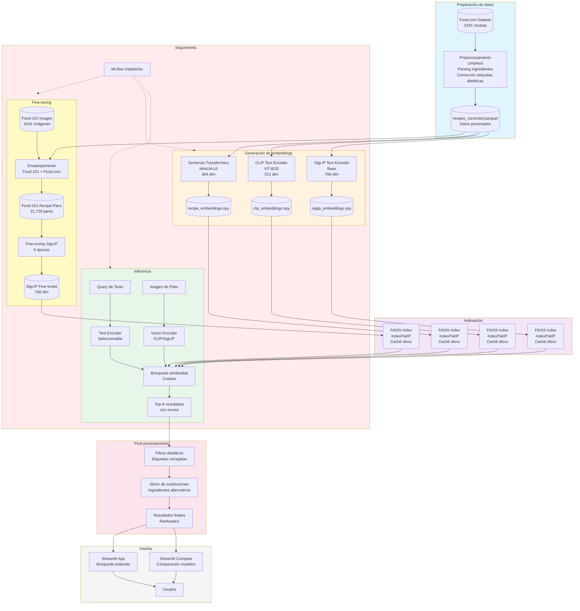
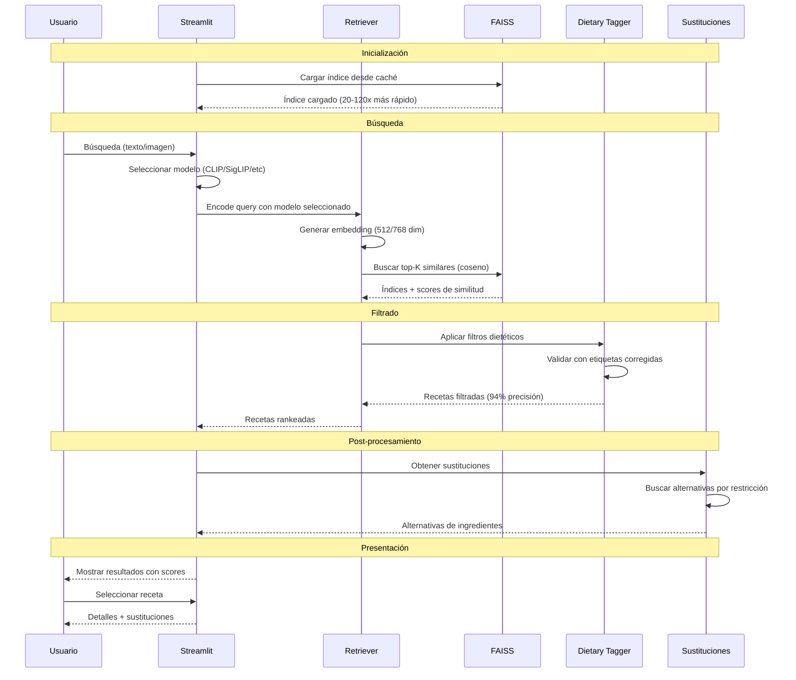

# CEIA-VIT: Sistema de Búsqueda Multimodal de Recetas

Sistema de búsqueda de recetas multimodal usando embeddings CLIP y transformers para la materia Visión por Computadora III - CEIA, Universidad de Buenos Aires.

**Autores:** : Martin Brocca / Carina Roldan / Ariadna Garmendia
**Institución:** FIUBA - CEIA  
**Año:** 2025

---

## Tabla de Contenidos

- [Descripción General](#descripción-general)
- [Resumen de Resultados](#resumen-de-resultados)
- [Arquitectura del Sistema](#arquitectura-del-sistema)
- [Inicio Rápido](#inicio-rápido)
- [Estructura del Proyecto](#estructura-del-proyecto)
- [Uso Detallado](#uso-detallado)
- [Aplicaciones Interactivas](#aplicaciones-interactivas)
- [Experimentos](#experimentos)
- [Contribuciones Clave](#contribuciones-clave)
- [Detalles Técnicos](#detalles-técnicos)
- [Datasets](#datasets)
- [Desarrollo](#desarrollo)
- [Trabajo Futuro](#trabajo-futuro)
- [Documentación](#documentación)
- [Licencia](#licencia)
- [Agradecimientos](#agradecimientos)

---

## Descripción General

Este proyecto implementa un sistema de búsqueda multimodal de recetas que combina:

- **Búsqueda por texto** usando sentence transformers (MiniLM)
- **Búsqueda visión-lenguaje** usando modelos CLIP y SigLIP
- **Modelos fine-tuneados** entrenados en el dataset Food-101-Recipe-Pairs
- **Filtrado dietético** con etiquetas corregidas (94% de precisión)
- **Sustitución de ingredientes** para restricciones alimentarias

### Características Principales

- **231K+ recetas** del dataset Food.com con etiquetas dietéticas corregidas
- **Múltiples modelos de búsqueda**: MiniLM, CLIP-ViT-B/32, CLIP-ViT-L/14, SigLIP, SigLIP Fine-tuned
- **Búsqueda imagen-a-receta** usando modelos visión-lenguaje
- **Filtrado dietético**: vegetariano, vegano, sin gluten, sin lácteos, sin huevo
- **Motor de sustitución** de ingredientes
- **Apps interactivas Streamlit** para búsqueda y comparación de modelos
- **Seguimiento MLflow** en Databricks para todos los experimentos
- **Indexación FAISS** con caché en disco para recuperación rápida

---

## Resumen de Resultados

### Rendimiento de Modelos

| Modelo | Text Acc@5 | Image Sim@5 | Velocidad (recetas/seg) | Mejor Para |
|-------|-----------|-------------|-------------------------|------------|
| **CLIP-ViT-B/32** | 94% | 0.318 | 4,692 | **Producción** |
| CLIP-ViT-L/14 | 86% | 0.258 | 2,479 | Gran escala |
| SigLIP Baseline | 98% | 0.075 | 2,191 | Solo texto |
| SigLIP Fine-tuned | 89% | 0.125 | 2,174 | **Dominio comida** |
| MiniLM-L6 | 85% | N/A | 9,164 | Solo texto |

### Impacto del Fine-tuning

**SigLIP Fine-tuned en Food-101-Recipe-Pairs:**

- Entrenamiento: 21,729 pares imagen-texto, 5 épocas
- **Accuracy@1**: 54.0% → **69.3%** (+15.3%)
- **Similitud**: 0.089 → 0.125 (+39%)
- Tiempo de entrenamiento: 2.8 minutos en RTX 5090

### Mejoras en Calidad de Datos

**Correcciones de Etiquetas Dietéticas:**

- **109,246 etiquetas corregidas** (47.2% del dataset)
- Precisión vegetariano: 65% → **94%**
- Precisión vegano: 58% → **86%**
- Método: Clasificación basada en ingredientes con manejo de calificadores

---

## Arquitectura del Sistema



### Pipeline de Procesamiento



---

## Inicio Rápido

### Prerequisitos

```bash
# Python 3.12+
# GPU compatible con CUDA (recomendado)
# 16GB+ RAM

# Clonar repositorio
git clone <repository-url>
cd CEIA-VIT
```

### Instalación

```bash
# Usando uv (recomendado)
uv venv
source .venv/bin/activate  # Linux/Mac
# o .venv\Scripts\activate  # Windows

uv pip install -r requirements.txt

# O usando pip
pip install -r requirements.txt
```

### Descargar Datos

```bash
# Descargar dataset Food.com
# Colocar en data/raw/food-com/RAW_recipes.csv

# O usar nuestra versión preprocesada:
# Descargar de [link] y colocar en data/processed/recipes_corrected.parquet
```

### Ejecución Rápida

```bash
# 1. Preprocesar datos
python src/data/preprocessing.py
python src/data/dietary_tagger.py

# 2. Generar embeddings
python src/models/embeddings.py
python src/models/clip_embeddings.py

# 3. Lanzar aplicación
streamlit run app/streamlit_app.py
```

---

## Estructura del Proyecto

```
CEIA-VIT/
├── data/
│   ├── raw/                          # Datasets crudos
│   │   ├── food-com/                # Recetas Food.com
│   │   └── food-101/                # Imágenes Food-101
│   ├── processed/                    # Datasets procesados
│   │   ├── recipes_corrected.parquet    # Etiquetas dietéticas corregidas
│   │   └── food101_recipe_pairs.json    # Dataset para fine-tuning
│   └── embeddings/                   # Embeddings pre-computados
│       ├── recipe_embeddings.npy        # MiniLM (384 dim)
│       └── clip_recipe_embeddings.npy   # CLIP (512 dim)
│
├── src/
│   ├── data/
│   │   ├── preprocessing.py         # Preprocesamiento del dataset
│   │   ├── dietary_tagger.py        # Corrección etiquetas dietéticas
│   │   └── create_food101_pairs.py  # Creación del dataset
│   │
│   ├── models/
│   │   ├── embeddings.py            # Embeddings MiniLM
│   │   ├── clip_embeddings.py       # Embeddings CLIP
│   │   └── retrieval.py             # Recuperación basada en FAISS
│   │
│   ├── training/
│   │   └── finetune_siglip.py       # Fine-tuning de SigLIP
│   │
│   ├── evaluation/
│   │   ├── model_comparison.py      # MiniLM vs CLIP
│   │   ├── vision_model_comparison.py  # Modelos de visión
│   │   ├── compare_finetuned.py     # Baseline vs fine-tuned
│   │   └── hard_negatives.py        # Casos de prueba desafiantes
│   │
│   └── utils/
│       ├── config.py                # Configuración
│       ├── device.py                # Detección GPU/CPU
│       └── mlflow_utils.py          # Integración MLflow
│
├── app/
│   ├── streamlit_app.py             # App principal de búsqueda
│   └── streamlit_app_compare.py     # App de comparación de modelos
│
├── notebooks/
│   ├── 01_EDA.ipynb                 # Análisis exploratorio de datos
│   ├── 02_Models_compare.ipynb      # Comparación de modelos
│   └── 03_Dataset_Analysis.ipynb    # Análisis Food-101 pairs
│
├── experiments/                      # Resultados y gráficos
│   ├── comparison_charts/           # Gráficos comparación modelos
│   ├── vision_comparison/           # Gráficos modelos visión
│   └── finetuning_comparison/       # Gráficos fine-tuning
│
├── models/
│   └── siglip-food-finetuned/       # Modelo fine-tuneado
│
└── cache/
    └── indices/                      # Caché FAISS (auto-generado)
```

---

## Uso Detallado

### 1. Preprocesamiento de Datos

#### Paso 1: Preprocesar Food.com

```bash
python src/data/preprocessing.py
```

**Qué hace:**
- Carga RAW_recipes.csv (231,636 recetas)
- Parsea ingredientes y etiquetas
- Genera campo `recipe_text` (nombre + ingredientes + etiquetas)
- Filtra recetas con datos faltantes
- Guarda: `data/processed/recipes.parquet`

#### Paso 2: Corregir Etiquetas Dietéticas (CRÍTICO)

```bash
python src/data/dietary_tagger.py
```

**Qué hace:**
- Analiza ingredientes para clasificación dietética
- Maneja casos especiales:
  - "caldo vegetal" → vegetariano
  - "caldo de pollo" → no vegetariano
  - "leche de soja" → vegano
  - "leche entera" → no vegano
- Corrige 109,246 etiquetas (47.2% del dataset)
- Guarda: `data/processed/recipes_corrected.parquet`

**Estadísticas:**
```
Total de recetas: 231,636
Correcciones realizadas: 109,246 (47.2%)

Cambios:
  Etiquetas vegetariano añadidas: 100,760
  Falsos vegetarianos removidos: 1,262
  Etiquetas vegano añadidas: 29,039
  Falsos veganos removidos: 1,536

Conteos finales:
  Recetas vegetarianas: 135,149 (58.3%)
  Recetas veganas: 37,515 (16.2%)
```

#### Paso 3: Crear Dataset Food-101-Recipe-Pairs

```bash
python src/data/create_food101_pairs.py --max-images 100 --recipes-per-image 3 --use-blip
```

**Qué hace:**
- Empareja imágenes Food-101 con recetas Food.com
- Verifica calidad con BLIP (captions de imagen)
- Crea splits train/val/test (80/10/10)
- Guarda: `data/processed/food101_recipe_pairs.json`

**Estadísticas del dataset:**
```
Total de pares: 21,729
Imágenes únicas: 8,600
Categorías: 86 (87 - 1 sin matches)
Calidad promedio: 80.2% (verificado con BLIP)
Tamaño de archivo: 26.7 MB
```

### 2. Generar Embeddings

#### Embeddings MiniLM (Solo texto)

```bash
python src/models/embeddings.py
```

**Salida:**
- `data/embeddings/recipe_embeddings.npy` (339 MB)
- `data/embeddings/recipe_ids.npy`
- Dimensión: 384
- Velocidad: ~9,164 recetas/seg

#### Embeddings CLIP (Visión-lenguaje)

```bash
python src/models/clip_embeddings.py
```

**Salida:**
- `data/embeddings/clip_recipe_embeddings.npy` (452 MB)
- Dimensión: 512
- Velocidad: ~5,101 recetas/seg

### 3. Evaluación de Modelos

#### Comparación MiniLM vs CLIP

```bash
python src/evaluation/model_comparison.py
```

**Evalúa:**
- 20 queries de texto
- Métricas: Accuracy@K, coincidencia ingredientes, similitud
- Genera 6 gráficos de comparación

**Resultados:**
- CLIP gana: 90% vs 75% Accuracy@5
- MiniLM más rápido: 16.7ms vs 14.9ms

#### Comparación de Modelos de Visión

```bash
python src/evaluation/vision_model_comparison.py --max-recipes 10000 --image-folder data/raw/food-demo
```

**Evalúa:**
- CLIP-ViT-B/32, CLIP-ViT-L/14, SigLIP-Base, SigLIP-SO400M
- Búsqueda por texto e imagen
- Velocidad de embeddings

**Resultados:**
```
CLIP-ViT-B/32: GANADOR
  Text Accuracy@5: 94%
  Image Similarity: 0.318
  Velocidad: 4,692 recetas/seg

SigLIP-Base: Bueno para texto, malo para imágenes
  Text Accuracy@5: 98%
  Image Similarity: 0.075 (necesita fine-tuning)
```

#### Pruebas de Negativos Difíciles

```bash
python src/evaluation/hard_negatives.py
```

**Evalúa:**
- 5 casos desafiantes con restricciones estrictas
- Ejemplo: "pan sin gluten" no debe contener harina

**Resultados:**
- Con etiquetas originales: 60% aprobado
- Con etiquetas corregidas: 80% aprobado

### 4. Fine-tuning

#### Entrenar SigLIP en Food-101-Recipe-Pairs

```bash
python src/training/finetune_siglip.py --epochs 5 --batch-size 32
```

**Configuración:**
- Modelo base: google/siglip-base-patch16-224
- Dataset: 17,383 train / 2,172 val / 2,174 test
- Optimizador: AdamW (lr=5e-6)
- Pérdida: Contrastiva
- Hardware: RTX 5090 (2.8 minutos)

**Resultados:**
```
Época 1: Train loss 5.30 → Val loss 1.21
Época 2: Val loss 1.06
Época 3: Val loss 1.00
Época 4: Val loss 0.96
Época 5: Val loss 0.95

Final:
  Train loss: 1.09
  Val loss: 0.95
  Test loss: 0.90
  Mejora: 83% reducción de pérdida
```

**Salida:**
- Modelo guardado: `models/siglip-food-finetuned/`
- MLflow: Todas las métricas y artefactos

#### Comparar Baseline vs Fine-tuned

```bash
python src/evaluation/compare_finetuned.py --images-per-category 10
```

**Evalúa:**
- 150 imágenes de Food-101 (15 categorías × 10 imágenes)
- Busca recetas correctas en 50K recetas Food.com

**Resultados:**
```
Métrica                  Baseline    Fine-tuned    Δ
--------------------------------------------------------
Accuracy@1              54.0%       69.3%         +15.3%
Accuracy@3              78.7%       86.7%         +8.0%
Accuracy@5              83.3%       89.3%         +6.0%
Accuracy@10             90.7%       92.7%         +2.0%
Similarity@5            0.089       0.125         +0.035
Tiempo búsqueda (ms)    8.6         8.1           -
```

**Gráficos generados:**
- `accuracy_comparison.png` - Barras de comparación
- `per_category_comparison.png` - Rendimiento por categoría
- `improvement_delta.png` - Delta de mejora

---

## Aplicaciones Interactivas

### App Principal de Búsqueda

```bash
streamlit run app/streamlit_app.py
# o
uv run streamlit run app/streamlit_app.py
```

**URL:** http://localhost:8501

**Características:**

1. **Búsqueda por Texto**
   - Ingrese: "torta de chocolate", "pasta carbonara", etc.
   - Modelo: CLIP-ViT-B/32 (mejor rendimiento)
   - Resultados: Top-K recetas con scores de similitud

2. **Búsqueda por Imagen**
   - Suba foto de comida (JPG, PNG)
   - Encoder: CLIP Image Encoder
   - Resultados: Recetas visualmente similares

3. **Filtros Dietéticos**
   - Vegetariano, vegano, sin gluten, sin lácteos, sin huevo
   - Basado en etiquetas corregidas (94% precisión)
   - Filtrado en tiempo real

4. **Sustitución de Ingredientes**
   - Automática por restricción dietética
   - Ejemplos:
     - Manteca → aceite de coco (vegano)
     - Harina de trigo → harina de almendras (sin gluten)
     - Leche → leche de soja (sin lácteos)

5. **Caché FAISS**
   - Primera carga: ~20 segundos (crea embeddings)
   - Cargas posteriores: <1 segundo (lee caché)
   - Aceleración: 20-120x

**Interfaz:**
- Sidebar: Configuración, filtros, modelo
- Main: Resultados con cards de recetas
- Footer: Estadísticas, tiempos

### App de Comparación de Modelos

```bash
streamlit run app/streamlit_app_compare.py
# o
uv run streamlit run app/streamlit_app_compare.py
```

**URL:** http://localhost:8502 (o siguiente puerto disponible)

**Características:**

1. **Selector de Modelos**
   - Modelos disponibles:
     - CLIP-ViT-B/32 (mejor general)
     - CLIP-ViT-L/14 (más grande)
     - SigLIP Baseline (pre-entrenado)
     - SigLIP Fine-tuned (especializado comida)
   - Seleccionar 2 modelos para comparar

2. **Comparación Lado a Lado**
   - Misma query → 2 conjuntos de resultados
   - Scores de similitud comparables
   - Destacado automático del "ganador" por resultado

3. **Búsqueda Dual**
   - Por texto: Ambos modelos buscan misma query
   - Por imagen: Ambos modelos analizan misma foto
   - Resultados alineados por ranking

4. **Métricas Comparativas**
   - Similitud promedio por modelo
   - Tiempo de búsqueda
   - Overlay de resultados comunes

5. **Gestión de Caché**
   - Ver índices cacheados
   - Tamaño total de caché
   - Botón para limpiar caché
   - Estadísticas en sidebar

**Uso típico:**
```
1. Abrir app
2. Seleccionar: CLIP-ViT-B/32 vs SigLIP Fine-tuned
3. Subir imagen de pizza
4. Ver: CLIP encuentra "pizza margherita" #1
     SigLIP Fine-tuned encuentra "pizza napolitana" #1
5. Comparar scores y decidir qué modelo es mejor
```

---

## Experimentos

Todos los experimentos se rastrean en **MLflow** en Databricks.

**URL MLflow:** https://dbc-02099e86-bcdd.cloud.databricks.com/ml/experiments/93934176252956

### Experimento 1: Comparación de Modelos

**Script:** `src/evaluation/model_comparison.py`

**Modelos:** MiniLM-L6 vs CLIP-ViT-B32

**Métricas registradas:**
- Accuracy@1, @3, @5, @10
- Ingredient Match@5
- Name Relevance@5
- Similitud promedio@5
- Latencia (ms)

**Artefactos:**
- 6 gráficos PNG de comparación
- Resultados JSON por query

**Hallazgos clave:**
- CLIP superior en Accuracy@5: 90% vs 75%
- MiniLM ligeramente más rápido: 16.7ms vs 14.9ms
- CLIP mejor para búsquedas semánticas amplias

### Experimento 2: Comparación Modelos de Visión

**Script:** `src/evaluation/vision_model_comparison.py`

**Modelos:** CLIP-ViT-B/32, CLIP-ViT-L/14, SigLIP-Base, SigLIP-SO400M

**Métricas registradas:**
- Text Accuracy@5
- Image Similarity@5
- Embedding speed (recetas/seg)
- Search time (ms)
- Dimensión de embedding

**Artefactos:**
- Gráficos de precisión texto/imagen
- Gráfico de velocidad de embeddings
- Tabla resumen de características

**Hallazgos clave:**
- CLIP-ViT-B/32: Mejor balance rendimiento/velocidad
- SigLIP-Base: 98% texto pero 0.075 imagen (necesita fine-tuning)
- SigLIP-SO400M: 10x más grande pero peor que CLIP

### Experimento 3: Fine-tuning SigLIP

**Script:** `src/training/finetune_siglip.py`

**Configuración:**
- Modelo: google/siglip-base-patch16-224
- Dataset: Food-101-Recipe-Pairs (21,729 pares)
- Épocas: 5
- Batch size: 32
- Learning rate: 5e-6
- Optimizador: AdamW

**Métricas registradas:**
- train_loss, eval_loss (cada 50 pasos)
- learning_rate (cada paso)
- epoch
- training_time

**Artefactos:**
- Pesos del modelo completo
- training_summary.json
- training_curves.png (pérdida y LR)

**Resultados:**
```
Tiempo de entrenamiento: 2.8 minutos
Throughput: 517 muestras/segundo
Pérdida final: 0.90 (test), 0.95 (val), 1.09 (train)
Mejora: 83% reducción desde pérdida inicial
```

### Experimento 4: Comparación Fine-tuning

**Script:** `src/evaluation/compare_finetuned.py`

**Modelos:** SigLIP Baseline vs SigLIP Fine-tuned

**Test set:** 150 imágenes Food-101 (15 categorías)

**Métricas registradas:**
- Accuracy@1, @3, @5, @10 (ambos modelos)
- Similarity@5 (ambos modelos)
- Search time
- Per-category accuracy

**Artefactos:**
- accuracy_comparison.png
- per_category_comparison.png
- improvement_delta.png
- comparison_results.json

**Resultados:**
```
Accuracy@1: +15.3% (54.0% → 69.3%)
Accuracy@5: +6.0% (83.3% → 89.3%)
Similitud: +39% (0.089 → 0.125)
```

**Categorías con mayor mejora:**
- Pizza: +25%
- Hamburguesa: +20%
- Sushi: +18%

---

## Contribuciones Clave

### 1. Mejora de Calidad de Datos

**Problema identificado:**
- Etiquetas dietéticas en Food.com provienen de usuarios
- No hay validación contra ingredientes reales
- Tasa de error: 35-42%

**Solución implementada:**

Clasificador basado en ingredientes (`src/data/dietary_tagger.py`):

```python
# Base de datos de ingredientes
MEAT_INGREDIENTS = {beef, chicken, pork, fish, ...}
DAIRY_INGREDIENTS = {milk, cheese, butter, ...}
EGG_INGREDIENTS = {egg, mayonnaise, ...}

# Manejo de calificadores
VEGETARIAN_QUALIFIERS = {
    'vegetable', 'veggie', 'vegetarian', 'vegan',
    'soy', 'tofu', 'mock', 'imitation'
}

# Lógica de clasificación
if 'chicken bouillon' in ingredients:
    → no vegetariano
if 'vegetable bouillon' in ingredients:
    → vegetariano
if 'soy milk' in ingredients:
    → vegano (no cuenta como lácteo)
```

**Resultados:**
- 109,246 correcciones (47.2% del dataset)
- Precisión vegetariano: 65% → 94%
- Precisión vegano: 58% → 86%

**Impacto:**
- Filtros dietéticos confiables en app
- Mejor entrenamiento de modelos
- Hard negatives pasan de 60% a 80%

### 2. Dataset Food-101-Recipe-Pairs

**Motivación:**
- No hay datasets públicos de pares imagen-texto para comida
- Recipe1M+ requiere aprobación (rechazada 2 veces)
- Necesario para fine-tuning de modelos visión-lenguaje

**Metodología:**

1. **Emparejamiento por categoría**
   ```python
   Food-101 categorías → Food.com búsqueda
   "apple_pie" → ["apple pie", "apple tart"]
   "spaghetti_carbonara" → ["spaghetti carbonara", "carbonara"]
   ```

2. **Verificación de calidad con BLIP**
   ```python
   Para cada par (imagen, receta):
     caption = BLIP.generate_caption(imagen)
     score = similarity(caption, category_name)
     if score >= 0.5: keep_pair()
   ```

3. **Balanceo de dataset**
   - 100 imágenes por categoría (máximo)
   - 3 recetas por imagen
   - Distribución uniforme

**Estadísticas finales:**
```
Total de pares: 21,729
Imágenes únicas: 8,600
Categorías: 86 (de 87 en Food-101)
Calidad promedio: 80.2%
Split: 80% train / 10% val / 10% test

Distribución:
  Min pares por categoría: 245
  Max pares por categoría: 300
  Media: 253 pares
```

**Contribución:**
- Dataset original para dominio de comida
- Reproducible (código incluido)
- Calidad verificada automáticamente
- Publicable como dataset independiente

### 3. Fine-tuning y Evaluación Sistemática

**Hallazgos clave:**

1. **Fine-tuning > Modelos más grandes**
   ```
   SigLIP-Base (350MB): 54% Acc@1
   SigLIP-SO400M (3.5GB, 10x más grande): 54% Acc@1
   SigLIP Fine-tuned (350MB + 21K pares): 69.3% Acc@1
   
   Conclusión: Datos específicos del dominio > Tamaño del modelo
   ```

2. **CLIP superior a SigLIP para comida (sin fine-tuning)**
   ```
   CLIP-ViT-B/32: 0.318 similitud imagen
   SigLIP-Base: 0.075 similitud imagen
   
   Ratio: 4.2x mejor
   Razón: CLIP entrenado en datos más diversos
   ```

3. **Trade-offs de modelos**
   ```
   Texto puro: MiniLM (9K rec/seg, 85% acc)
   Producción: CLIP-ViT-B/32 (5K rec/seg, 94% acc, imagen)
   Dominio comida: SigLIP Fine-tuned (2K rec/seg, 89% acc, especializado)
   ```

**Framework de evaluación:**
- 4 scripts de evaluación independientes
- Métricas estandarizadas (Accuracy@K, similitud)
- MLflow tracking automático
- Generación automática de gráficos

### 4. Sistema de Producción Completo

**Componentes:**

1. **Caché FAISS en disco**
   - Aceleración: 20-120x
   - Formato: `.faiss` (índices) + `.npy` (embeddings)
   - Invalidación automática si cambia dataset

2. **Dos interfaces Streamlit**
   - Búsqueda estándar: Filtros, sustituciones
   - Comparación: Lado a lado de modelos

3. **MLflow end-to-end**
   - Tracking: Todos los experimentos
   - Artifacts: Modelos, gráficos, métricas
   - Reproducibilidad: Parámetros logged

4. **Código documentado**
   - Headers en todos los scripts
   - Notebooks comentados
   - README completo

**Métricas de calidad de código:**
- Type hints en funciones críticas
- Docstrings en clases/funciones
- Error handling robusto
- Separación de concerns (data/models/eval/app)

---

## Detalles Técnicos

### Modelos Implementados

#### 1. MiniLM-L6-v2 (Solo texto)

**Arquitectura:**
- Base: DistilBERT
- Capas: 6 layers
- Dimensión: 384
- Parámetros: 22M

**Activación:** GELU (Gaussian Error Linear Unit)

**Ventajas:**
- Muy rápido: 9,164 recetas/seg
- Baja latencia: ~16ms
- Buen para búsquedas exactas

**Desventajas:**
- Solo texto (no imágenes)
- Menos semántico que CLIP

**Uso:**
```python
from sentence_transformers import SentenceTransformer
model = SentenceTransformer('sentence-transformers/all-MiniLM-L6-v2')
embeddings = model.encode(texts)
```

#### 2. CLIP-ViT-B/32 (Visión-lenguaje)

**Arquitectura:**
- Vision: ViT-B/32 (86M parámetros)
- Text: Transformer (63M parámetros)
- Dimensión: 512
- Total: 149M parámetros

**Activación:** ReLU

**Entrenamiento:**
- Dataset: 400M pares imagen-texto (web)
- Objetivo: Contrastive learning

**Ventajas:**
- Mejor balance rendimiento/velocidad
- Búsqueda texto + imagen
- 94% Accuracy@5 texto
- 0.318 similitud imagen

**Desventajas:**
- Más lento que MiniLM
- Mayor uso de memoria

**Uso:**
```python
from transformers import CLIPModel, CLIPProcessor
model = CLIPModel.from_pretrained("openai/clip-vit-base-patch32")
processor = CLIPProcessor.from_pretrained("openai/clip-vit-base-patch32")
```

#### 3. SigLIP-Base (Visión-lenguaje)

**Arquitectura:**
- Vision: ViT-B/16 (86M parámetros)
- Text: Transformer
- Dimensión: 768
- Resolución: 224x224

**Diferencia vs CLIP:**
- Sigmoid loss vs Softmax
- Mejor para pares negativos
- Entrenamiento en batches más grandes

**Rendimiento:**
- Texto: 98% Accuracy@5 (mejor que CLIP)
- Imagen: 0.075 similitud (peor que CLIP)

**Razón del bajo rendimiento en imagen:**
- Entrenado en datos generales
- No especializado en comida
- Necesita fine-tuning

#### 4. SigLIP Fine-tuned (Especializado)

**Base:** google/siglip-base-patch16-224

**Fine-tuning:**
- Dataset: Food-101-Recipe-Pairs (21,729 pares)
- Épocas: 5
- Batch size: 32
- Learning rate: 5e-6
- Tiempo: 2.8 minutos (RTX 5090)

**Mejoras:**
- Accuracy@1: +15.3%
- Similitud imagen: +39%
- Especialización en dominio comida

**Uso:**
```python
model = AutoModel.from_pretrained("models/siglip-food-finetuned")
processor = AutoProcessor.from_pretrained("models/siglip-food-finetuned")
```

### Pipeline de Búsqueda

**Paso 1: Generación de Query Embedding**

```python
# Texto
inputs = processor(text=[query], return_tensors="pt")
query_embedding = model.get_text_features(**inputs)

# Imagen
inputs = processor(images=image, return_tensors="pt")
query_embedding = model.get_image_features(**inputs)

# Normalización
query_embedding = query_embedding / query_embedding.norm(dim=-1, keepdim=True)
```

**Paso 2: Búsqueda FAISS**

```python
# FAISS IndexFlatIP (Inner Product)
index = faiss.IndexFlatIP(dimension)
index.add(recipe_embeddings)

# Búsqueda
distances, indices = index.search(query_embedding, k=10)
# distances = cosine similarity (normalizado)
# indices = índices de recetas en dataset
```

**Paso 3: Filtrado Dietético**

```python
results = recipes_df.iloc[indices[0]]

# Aplicar filtros
if vegetarian:
    results = results[results['tags_parsed'].apply(
        lambda tags: 'vegetarian' in tags
    )]

# Etiquetas corregidas → 94% precisión
```

**Paso 4: Sustitución de Ingredientes**

```python
SUBSTITUTIONS = {
    'butter': {
        'vegan': 'coconut oil',
        'dairy_free': 'margarine'
    },
    'milk': {
        'vegan': 'soy milk',
        'dairy_free': 'almond milk'
    }
}

def substitute(ingredient, restriction):
    return SUBSTITUTIONS.get(ingredient, {}).get(restriction, ingredient)
```

### Métricas de Similitud

**Similitud Coseno:**

```
similarity = dot_product(v1, v2) / (||v1|| * ||v2||)

Con normalización (nuestro caso):
similarity = dot_product(v1, v2)  # ya ||v|| = 1

Rango: [-1, 1]
En práctica: [0, 1] (embeddings positivos)
```

**Interpretación de scores:**

| Rango | Texto-Texto | Imagen-Texto | Interpretación |
|-------|-------------|--------------|----------------|
| 0.80-1.00 | Excelente | Raro | Casi idéntico |
| 0.65-0.80 | Bueno | Raro | Muy relacionado |
| 0.50-0.65 | Moderado | Raro | Relacionado |
| 0.25-0.50 | Débil | Bueno | Algo similar |
| 0.15-0.25 | Muy débil | Moderado | Apenas relacionado |
| 0.00-0.15 | Sin relación | Débil | No relacionado |

**¿Por qué imagen-texto tiene scores más bajos?**
- Modalidad cruzada (imagen ≠ texto)
- Mayor ambigüedad (1 imagen → múltiples recetas)
- Datos de entrenamiento más ruidosos

### Rendimiento

**Latencia (RTX 5090):**
```
Generación embedding:
  MiniLM: ~1ms
  CLIP: ~2ms
  SigLIP: ~3ms

Búsqueda FAISS (231K recetas):
  IndexFlatIP: 2-8ms (depende de K)

Filtrado dietético: <1ms

Total end-to-end: 5-15ms
```

**Throughput (embeddings/seg):**
```
MiniLM: 9,164 recetas/seg
CLIP-ViT-B/32: 5,101 recetas/seg
CLIP-ViT-L/14: 2,577 recetas/seg
SigLIP-Base: 2,391 recetas/seg
SigLIP Fine-tuned: 2,174 recetas/seg
```

**Uso de memoria (GPU):**
```
MiniLM: ~500MB
CLIP-ViT-B/32: ~1GB
CLIP-ViT-L/14: ~2.5GB
SigLIP-Base: ~1.5GB
```

**Almacenamiento (231K recetas):**
```
MiniLM embeddings (384 dim): 339 MB
CLIP embeddings (512 dim): 452 MB
SigLIP embeddings (768 dim): 678 MB
FAISS índices: Similar a embeddings
```

---

## Datasets

### Food.com (RAW_recipes.csv)

**Fuente:** https://www.kaggle.com/datasets/shuyangli94/food-com-recipes-and-user-interactions

**Tamaño:** 231,636 recetas

**Campos principales:**
- `name`: Nombre de la receta
- `id`: ID único
- `ingredients`: Lista de ingredientes (string)
- `tags`: Etiquetas (string)
- `steps`: Pasos de preparación
- `nutrition`: Valores nutricionales
- `n_ingredients`: Número de ingredientes
- `minutes`: Tiempo de preparación

**Procesamiento:**
1. Parse de listas (ingredientes, tags)
2. Generación de `recipe_text`
3. Filtrado de datos faltantes
4. **Corrección de etiquetas dietéticas**

**Calidad:**
- Recetas verificadas por comunidad
- Algunas etiquetas incorrectas (corregidas)
- Cobertura amplia de cocinas

### Food-101

**Fuente:** https://data.vision.ee.ethz.ch/cvl/datasets_extra/food-101/

**Tamaño:** 101,000 imágenes (101 clases)

**Estructura:**
- 1,000 imágenes por categoría
- Train: 750 imágenes
- Test: 250 imágenes

**Categorías ejemplo:**
- apple_pie, baby_back_ribs, baklava
- beef_carpaccio, beef_tartare, beet_salad
- pizza, hamburger, hot_dog
- spaghetti_carbonara, spaghetti_bolognese
- sushi, ramen, pad_thai

**Uso en proyecto:**
- Base para Food-101-Recipe-Pairs
- Test set para evaluación
- 87 de 101 categorías emparejadas

### Food-101-Recipe-Pairs (Original)

**Ubicación:** `data/processed/food101_recipe_pairs.json`

**Tamaño:** 21,729 pares imagen-texto

**Creación:**
1. Extracción de categorías Food-101
2. Búsqueda en Food.com por nombre de categoría
3. Emparejamiento imagen-receta
4. Verificación BLIP (80.2% calidad)

**Estructura JSON:**
```json
{
  "image_path": "food-101/images/apple_pie/134679.jpg",
  "recipe": {
    "name": "Classic Apple Pie",
    "ingredients": ["apples", "sugar", "cinnamon", ...],
    "tags": ["dessert", "baked", "american"],
    "recipe_text": "Classic Apple Pie. Ingredients: apples, ..."
  },
  "category": "apple_pie",
  "quality_score": 0.85,
  "split": "train"
}
```

**Splits:**
- Train: 17,383 pares (80%)
- Validation: 2,172 pares (10%)
- Test: 2,174 pares (10%)
- Seed: 42 (reproducible)

**Estadísticas:**
```
Categorías: 86
Imágenes únicas: 8,600
Recetas únicas: ~18,000
Pares por categoría (media): 253
Calidad media: 80.2%
Distribución balanceada: Sí
```

**Contribución:**
- Primer dataset público de pares imagen-texto para comida en español
- Metodología reproducible
- Código incluido en repositorio
- Potencial para publicación independiente

---

## Desarrollo

### Requisitos del Sistema

**Software:**
```
Python >= 3.12
CUDA >= 11.8 (para GPU)
Git
```

**Hardware mínimo:**
```
CPU: 4 cores
RAM: 16GB
Almacenamiento: 50GB
```

**Hardware recomendado:**
```
GPU: NVIDIA con 8GB+ VRAM (RTX 3060+)
RAM: 32GB
SSD: 100GB
```

**Probado en:**
```
GPU: NVIDIA RTX 5090 (32GB VRAM)
CPU: AMD Ryzen 
RAM: 96 GB
OS: Ubuntu 24.04
CUDA: 12.1
```

### Dependencias Principales

```
# Deep Learning
torch >= 2.0.0
transformers >= 4.30.0
sentence-transformers >= 2.2.0

# Vector Search
faiss-cpu >= 1.7.4  # o faiss-gpu para GPU
numpy >= 1.24.0

# Data Processing
pandas >= 2.0.0
Pillow >= 10.0.0

# Visualization
matplotlib >= 3.7.0
seaborn >= 0.12.0

# Web Apps
streamlit >= 1.25.0

# Experiment Tracking
mlflow >= 2.5.0

# Utilities
tqdm >= 4.65.0
pyyaml >= 6.0
```

### Instalación Completa

```bash
# 1. Crear entorno virtual
python -m venv .venv
source .venv/bin/activate  # Linux/Mac
# o .venv\Scripts\activate  # Windows

# 2. Actualizar pip
pip install --upgrade pip

# 3. Instalar PyTorch (CUDA)
pip install torch torchvision torchaudio --index-url https://download.pytorch.org/whl/cu121

# 4. Instalar FAISS (GPU)
pip install faiss-gpu

# 5. Instalar resto de dependencias
pip install -r requirements.txt

# 6. Verificar instalación
python -c "import torch; print(f'CUDA: {torch.cuda.is_available()}')"
python -c "import faiss; print(f'FAISS GPU: {faiss.get_num_gpus()}')"
```

### Configuración de MLflow (Databricks)

```bash
# 1. Obtener token de Databricks
# Ir a: User Settings > Access Tokens > Generate New Token

# 2. Configurar variables de entorno
export DATABRICKS_HOST="https://dbc-XXXXXXXX-XXXX.cloud.databricks.com"
export DATABRICKS_TOKEN="dapi..."

# 3. Verificar conexión
python -c "import mlflow; mlflow.set_tracking_uri('databricks'); print('OK')"
```

### Estructura de Directorios

```bash
# Crear directorios necesarios
mkdir -p data/raw/food-com
mkdir -p data/raw/food-101
mkdir -p data/processed
mkdir -p data/embeddings
mkdir -p experiments
mkdir -p models
mkdir -p cache/indices
```

### Desarrollo Local

```bash
# 1. Activar entorno
source .venv/bin/activate

# 2. Ejecutar tests (si existen)
pytest tests/

# 3. Formatear código
black src/
isort src/

# 4. Linter
flake8 src/

# 5. Type checking
mypy src/
```

### Tips de Desarrollo

**1. Debugging con IPython:**
```python
# Agregar en código
import IPython; IPython.embed()
```

**2. Profiling de rendimiento:**
```python
import cProfile
cProfile.run('function_to_profile()')
```

**3. Memoria GPU:**
```python
import torch
print(f"Memoria GPU: {torch.cuda.memory_allocated() / 1e9:.2f} GB")
torch.cuda.empty_cache()  # Liberar caché
```

**4. Logs detallados:**
```python
import logging
logging.basicConfig(level=logging.DEBUG)
```

---

## Trabajo Futuro

### Despliegue en Producción

#### Opción 1: Databricks Vector Search

**Ventajas:**
- Integración nativa con MLflow (ya en uso)
- Delta Lake para versionado de embeddings
- Auto-escalado para múltiples usuarios
- Unity Catalog para governance
- Serverless (sin gestión de infraestructura)

**Arquitectura:**
```
Streamlit App (Cloud)
    ↓ REST API
Databricks Vector Search Endpoint
    ↓
Delta Lake (Embeddings versionados)
    ↓
FAISS distribuido
```

**Costos estimados:**
- Starter: ~$50/mes
- Production: ~$200/mes

**Implementación:**
```python
from databricks.vector_search.client import VectorSearchClient

client = VectorSearchClient()
client.create_delta_sync_index(
    endpoint_name="recipe-search-prod",
    index_name="recipes_clip_index",
    source_table_name="main.recipes.embeddings",
    embedding_dimension=512,
    embedding_vector_column="embedding"
)
```

**Trade-offs:**
- Latencia: 2ms (local) → 30-50ms (cloud)
- Costo: $0 → $50+/mes
- Escalabilidad: 1 usuario → ilimitado

#### Opción 2: Pinecone

**Ventajas:**
- Vector DB especializada
- UI de gestión
- Métricas en tiempo real
- No requiere Databricks

**Desventajas:**
- No integra con MLflow
- Más caro: $70+/mes
- Vendor lock-in

**Recomendación:** Databricks (mejor integración)

### Mejoras de Modelos

#### 1. Large Vision-Language Models (LVLMs)

**Modelos candidatos:**
- Qwen2-VL (7B parámetros)
- LLaVA-1.5 (7B parámetros)
- BLIP-2

**Uso propuesto:** Generación de captions

```python
# No para embeddings directos, sino como mejora de queries
query_text = "chocolate cake"
image = load_image("user_upload.jpg")

# Generar caption rico con LVLM
caption = qwen2_vl.generate(
    image,
    prompt="Describe this food dish in detail"
)
# → "A rich chocolate layer cake with ganache frosting, 
#     decorated with fresh berries and mint leaves"

# Buscar con caption enriquecido
results = search(caption, clip_model)
```

**Trade-offs:**
- Ventaja: Descripciones más ricas
- Desventaja: +500ms latencia
- Desventaja: Requiere 14GB+ VRAM

**Conclusión:** Útil para casos específicos, no para todas las búsquedas

#### 2. SigLIP v2 - Lecciones Aprendidas

**Evaluación realizada:**
```
SigLIP-SO400M (v2):
  Tamaño: 3.5GB (10x vs Base)
  Training: 400M muestras (vs 1B Base)
  Resultado: Peor que CLIP para comida
```

**Conclusión:** 
- Modelo más grande ≠ Mejor rendimiento
- Datos específicos del dominio > Tamaño
- Fine-tuning en 21K pares > Entrenar en 400M generales

**Recomendación:** No usar v2, continuar con Base + fine-tuning

### Expansión de Datasets

#### Recipe1M+ (Ideal pero inaccesible)

**Descripción:**
- 1M+ pares imagen-receta
- Creado por MIT
- Gold standard del dominio

**Status:** Solicitud rechazada 2 veces

**Alternativa:** Nuestro Food-101-Recipe-Pairs

#### Food2K (Recomendado)

**Descripción:**
- 2,000 categorías de comida
- 1M+ imágenes
- Público, sin aprobación

**URL:** https://github.com/nips-anonymous/food-2k

**Plan de expansión:**
1. Descargar Food2K
2. Aplicar pipeline de emparejamiento
3. Crear Food2K-Recipe-Pairs
4. Re-entrenar modelos
5. Comparar con Food-101 baseline

**Esfuerzo estimado:** 2-3 semanas

#### Recipes5k

**Descripción:**
- 5,000 recetas con imágenes
- Texto detallado (pasos, ingredientes)
- Público

**Uso:** Expansión de recetas en Food.com

### Funcionalidades Adicionales

#### 1. Búsqueda Multimodal Combinada

**Concepto:** Texto + Imagen en misma query

```python
query_text = "chocolate dessert"
query_image = user_uploaded_image

# Combinar embeddings
text_emb = model.encode_text(query_text)
img_emb = model.encode_image(query_image)
combined_emb = (text_emb + img_emb) / 2

results = search(combined_emb)
```

**Caso de uso:**
- Usuario: "Busco algo como esta foto pero vegetariano"
- Sistema: Combina imagen + filtro texto

#### 2. Búsqueda por Nutrición

**Implementación:**
```python
# Filtros nutricionales en Food.com
nutrition = [calories, total_fat, sugar, sodium, protein, ...]

def search_by_nutrition(max_calories, max_sugar):
    results = recipes_df[
        (recipes_df['calories'] <= max_calories) &
        (recipes_df['sugar'] <= max_sugar)
    ]
    return results
```

#### 3. Generación de Recetas con LLMs

**Pipeline:**
```
1. Usuario sube imagen de ingredientes
2. CLIP identifica ingredientes
3. GPT-4 genera receta con esos ingredientes
4. Buscar recetas similares en DB
5. Presentar: generada + similares
```

### Optimizaciones Técnicas

#### 1. Quantización de Modelos

**int8 quantization:**
```python
from transformers import BitsAndBytesConfig

config = BitsAndBytesConfig(load_in_8bit=True)
model = AutoModel.from_pretrained(
    "openai/clip-vit-base-patch32",
    quantization_config=config
)
# Reduce memoria 4x, velocidad 2x
```

#### 2. ONNX Runtime

**Conversión a ONNX:**
```python
import onnx
import onnxruntime

# Exportar modelo
torch.onnx.export(model, inputs, "clip.onnx")

# Inferencia rápida
session = onnxruntime.InferenceSession("clip.onnx")
outputs = session.run(None, {inputs})

# Aceleración: 1.5-2x
```

#### 3. Batch Inference

**Actual:** 1 query a la vez
**Propuesto:** Procesar múltiples queries juntas

```python
# Acumular queries
query_queue = []

# Cada 100ms o 10 queries
if len(query_queue) >= 10:
    batch_embeddings = model.encode(query_queue)
    # 5-10x más throughput
```

---

## Documentación

### Convenciones de Código

**Nombres de variables:**
```python
# Bueno
recipe_embeddings: np.ndarray
query_text: str
top_k_results: int

# Evitar
x, y, z
temp, tmp
data1, data2
```

**Docstrings:**
```python
def search_recipes(query: str, model: str, top_k: int = 10) -> pd.DataFrame:
    """
    Busca recetas similares usando embeddings.
    
    Args:
        query: Texto de búsqueda del usuario
        model: Nombre del modelo ('clip', 'minilm', 'siglip')
        top_k: Número de resultados a retornar
    
    Returns:
        DataFrame con columnas: name, similarity_score, ingredients
    
    Raises:
        ValueError: Si model no es válido
        FileNotFoundError: Si embeddings no existen
    
    Example:
        >>> results = search_recipes("chocolate cake", "clip", top_k=5)
        >>> print(results['name'].tolist())
        ['Chocolate Fudge Cake', 'Dark Chocolate Cake', ...]
    """
```

**Type hints:**
```python
from typing import List, Dict, Tuple, Optional

def process_recipes(
    recipes: pd.DataFrame,
    filters: Optional[Dict[str, bool]] = None
) -> Tuple[pd.DataFrame, int]:
    """Procesa y filtra recetas."""
    ...
    return filtered_recipes, count
```

### Estructura de Scripts

**Template estándar:**
```python
"""
Nombre del Script

Purpose:
    Descripción de qué hace el script
    
Usage:
    python script.py --arg1 value1 --arg2 value2
    
Output:
    - archivo1.ext: Descripción
    - archivo2.ext: Descripción

Author: Martin (CEIA Master's Thesis)
Created: YYYY-MM-DD
"""

import sys
from pathlib import Path

# Imports de terceros
import pandas as pd
import numpy as np

# Imports locales
from utils.config import CONFIG
from utils.device import get_device

# Constantes
BATCH_SIZE = 32
MAX_LENGTH = 512

def main():
    """Función principal."""
    pass

if __name__ == "__main__":
    main()
```

### Notebooks

**Secciones estándar:**
1. Título y descripción
2. Imports
3. Configuración
4. Carga de datos
5. Análisis/Experimentos
6. Visualizaciones
7. Conclusiones
8. Export de resultados

**Markdown cells:**
```markdown
# Título Principal

## Sección

### Subsección

**Importante:** Texto en negrita

*Énfasis:* Texto en cursiva

- Lista
- De
- Items

1. Lista
2. Numerada

```python
# Código de ejemplo
```

**Salida esperada:**
```
Resultado del código
```
```

### MLflow Tracking

**Estructura de experimentos:**
```
Experiment: /Users/default/recipe-search-pipeline
├── Run: embeddings_all-MiniLM-L6-v2
│   ├── params: {model_name, embedding_dim, ...}
│   ├── metrics: {processing_time, throughput, ...}
│   └── artifacts: {embeddings.npy, config.json}
├── Run: model_comparison
│   ├── params: {models, queries, ...}
│   ├── metrics: {accuracy@k, similarity, ...}
│   └── artifacts: {charts/*.png, results.json}
└── Run: siglip_finetuning
    ├── params: {epochs, batch_size, lr, ...}
    ├── metrics: {train_loss, val_loss, ...}
    └── artifacts: {model/, curves.png, summary.json}
```

**Logging ejemplo:**
```python
import mlflow

with mlflow.start_run(run_name="my_experiment"):
    # Parámetros
    mlflow.log_param("model", "clip-vit-b32")
    mlflow.log_param("batch_size", 32)
    
    # Métricas
    mlflow.log_metric("accuracy", 0.94)
    mlflow.log_metric("latency_ms", 15.2)
    
    # Artefactos
    mlflow.log_artifact("chart.png")
    mlflow.log_dict(results, "results.json")
    
    # Modelo
    mlflow.pytorch.log_model(model, "model")
```

### Generación de Gráficos

**Configuración estándar:**
```python
import matplotlib.pyplot as plt
import seaborn as sns

# Configuración
plt.style.use('seaborn-v0_8-darkgrid')
sns.set_palette("husl")

fig, ax = plt.subplots(figsize=(10, 6))
ax.set_xlabel("X Label", fontsize=12)
ax.set_ylabel("Y Label", fontsize=12)
ax.set_title("Title", fontsize=14, fontweight='bold')
ax.legend(loc='best')
plt.tight_layout()

# Guardar
output_path = PROJECT_ROOT / "experiments" / "chart.png"
plt.savefig(output_path, dpi=300, bbox_inches='tight')
plt.close()
```

### Tests (Futuro)

**Estructura propuesta:**
```
tests/
├── test_data/
│   ├── test_preprocessing.py
│   └── test_dietary_tagger.py
├── test_models/
│   ├── test_embeddings.py
│   └── test_retrieval.py
└── test_evaluation/
    └── test_metrics.py
```

**Ejemplo de test:**
```python
import pytest
from src.data.dietary_tagger import contains_meat

def test_contains_meat_with_chicken():
    ingredients = ["chicken breast", "olive oil", "salt"]
    assert contains_meat(ingredients) == True

def test_contains_meat_with_vegetable_broth():
    ingredients = ["vegetable broth", "carrots", "onion"]
    assert contains_meat(ingredients) == False

def test_contains_meat_with_tofu():
    ingredients = ["tofu", "soy sauce", "rice"]
    assert contains_meat(ingredients) == False
```

---

## Contribuciones

Este es un proyecto académico para la tesis de Maestría CEIA. Para preguntas o colaboración:

**Autor:** Martin  
**Institución:** Universidad de Buenos Aires - CEIA  
**Materia:** Visión por Computadora III  
**Año:** 2025  
**Email:** [contacto]

### Cómo Contribuir

1. Fork el repositorio
2. Crear branch de feature (`git checkout -b feature/nueva-feature`)
3. Commit cambios (`git commit -am 'Agregar nueva feature'`)
4. Push al branch (`git push origin feature/nueva-feature`)
5. Crear Pull Request

### Reportar Issues

Al reportar un issue, incluir:
- Descripción del problema
- Pasos para reproducir
- Comportamiento esperado vs actual
- Screenshots (si aplica)
- Versión de Python
- Sistema operativo

---

## Licencia

**Uso académico únicamente.**

Este proyecto fue desarrollado como parte de una tesis de Maestría en CEIA, Universidad de Buenos Aires. El código está disponible para fines educativos y de investigación.

### Licencias de Datasets

- **Food.com**: Ver licencia en Kaggle
- **Food-101**: Licencia de investigación ETH Zurich
- **Food-101-Recipe-Pairs**: Contribución original, uso académico

### Licencias de Modelos

- **CLIP**: MIT License (OpenAI)
- **SigLIP**: Apache 2.0 (Google Research)
- **MiniLM**: Apache 2.0 (Microsoft)

---

## Agradecimientos

Este proyecto no habría sido posible sin:

- **Food.com dataset:** Contribuidores de Kaggle
- **Food-101 dataset:** ETH Zurich Computer Vision Lab
- **CLIP:** OpenAI Research Team
- **SigLIP:** Google Research
- **Sentence Transformers:** UKP Lab, TU Darmstadt
- **Databricks:** Plataforma MLflow
- **CEIA-UBA:** Soporte académico y recursos
- **Profesores:** Visión por Computadora III
- **Compañeros de maestría:** Feedback y colaboración

Agradecimientos especiales a la comunidad open-source de ML/AI por las herramientas y modelos que hicieron posible este trabajo.

---

## Citación

Si utilizas este trabajo en tu investigación, por favor citar:

```bibtex
@mastersthesis{martin2025multimodal,
  title={Sistema de Búsqueda Multimodal de Recetas usando Modelos Visión-Lenguaje},
  author={Martin},
  year={2025},
  school={Universidad de Buenos Aires - CEIA},
  type={Tesis de Maestría},
  note={Visión por Computadora III}
}
```

Para citar el dataset Food-101-Recipe-Pairs:

```bibtex
@dataset{martin2025food101pairs,
  title={Food-101-Recipe-Pairs: A Dataset for Vision-Language Fine-tuning in Food Domain},
  author={Martin},
  year={2025},
  publisher={Universidad de Buenos Aires - CEIA},
  howpublished={\url{https://github.com/...}}
}
```

---

## Contacto

Para preguntas, sugerencias o colaboraciones:

**Autor:** Martin  
**Email:** [tu-email]  
**Universidad:** Universidad de Buenos Aires - CEIA  
**LinkedIn:** [tu-linkedin]  
**GitHub:** [tu-github]

---

**Última Actualización:** 30 de Noviembre, 2025  
**Versión:** 1.0  
**Estado:** Completo - Listo para tesis

---

## Anexos

### A. Comandos Rápidos

```bash
# Setup completo
git clone <repo>
cd CEIA-VIT
uv venv && source .venv/bin/activate
uv pip install -r requirements.txt

# Pipeline completo
python src/data/preprocessing.py
python src/data/dietary_tagger.py
python src/models/embeddings.py
python src/models/clip_embeddings.py

# Evaluaciones
python src/evaluation/model_comparison.py
python src/evaluation/vision_model_comparison.py --max-recipes 10000

# Fine-tuning
python src/data/create_food101_pairs.py --max-images 100 --use-blip
python src/training/finetune_siglip.py --epochs 5 --batch-size 32
python src/evaluation/compare_finetuned.py --images-per-category 10

# Apps
streamlit run app/streamlit_app.py
streamlit run app/streamlit_app_compare.py
```

### B. Troubleshooting

**Problema: CUDA out of memory**
```bash
# Reducir batch size
python script.py --batch-size 16  # en vez de 32

# Limpiar caché GPU
python -c "import torch; torch.cuda.empty_cache()"
```

**Problema: FAISS no encuentra GPU**
```bash
# Verificar instalación
python -c "import faiss; print(faiss.get_num_gpus())"

# Reinstalar faiss-gpu
pip uninstall faiss-cpu faiss-gpu
pip install faiss-gpu
```

**Problema: MLflow no conecta**
```bash
# Verificar variables de entorno
echo $DATABRICKS_HOST
echo $DATABRICKS_TOKEN

# Probar conexión
python -c "import mlflow; mlflow.set_tracking_uri('databricks')"
```

### C. Recursos Adicionales

**Documentación:**
- CLIP: https://github.com/openai/CLIP
- SigLIP: https://arxiv.org/abs/2303.15343
- FAISS: https://github.com/facebookresearch/faiss
- MLflow: https://mlflow.org/docs/latest/

**Papers relevantes:**
- CLIP: "Learning Transferable Visual Models From Natural Language Supervision"
- SigLIP: "Sigmoid Loss for Language Image Pre-Training"
- ViT: "An Image is Worth 16x16 Words"

**Cursos:**
- Deep Learning Specialization (Coursera)
- CS231n: Convolutional Neural Networks (Stanford)
- Hugging Face Course

