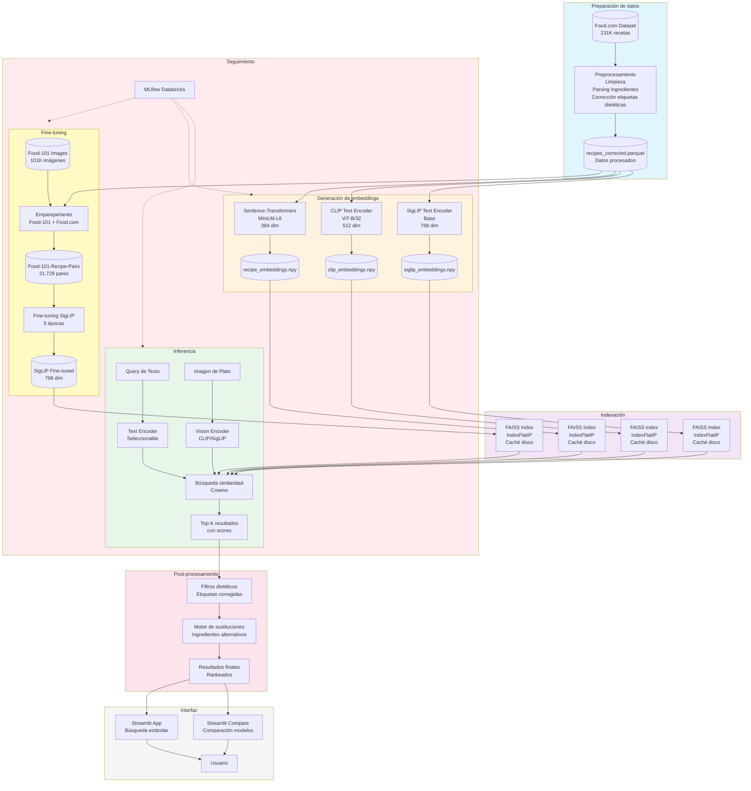
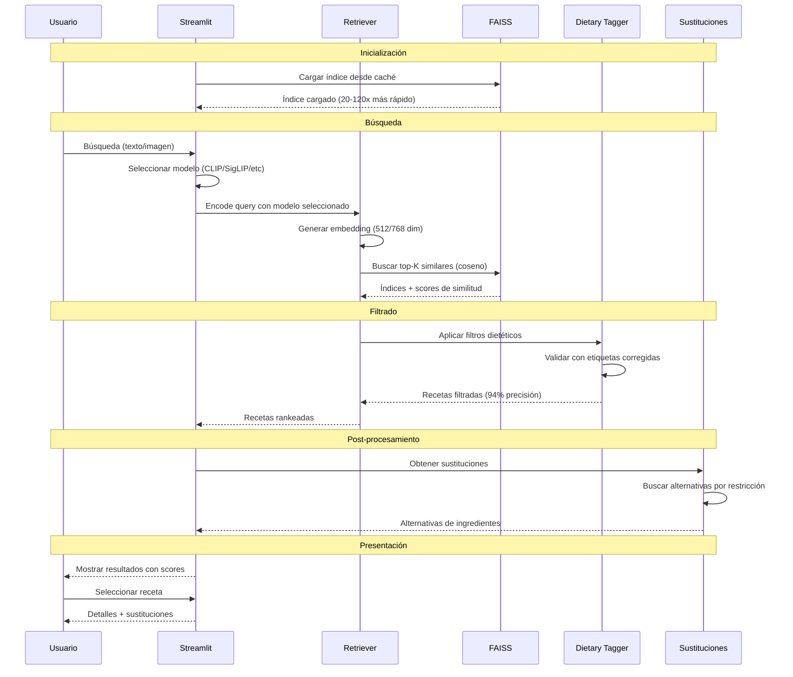

# CEIA-VIT: Sistema de Búsqueda Multimodal de Recetas

Sistema de búsqueda de recetas multimodal usando embeddings CLIP y transformers para la materia Visión por Computadora III - CEIA, Universidad de Buenos Aires.

**Autores:** : Martin Brocca / María Carina Roldan / Ariadna Garmendia
FIUBA - CEIA  
**Año:** 2025

---

## Tabla de Contenidos

- [Descripción General](#descripción-general)
- [Resumen de Resultados](#resumen-de-resultados)
- [Arquitectura del Sistema](#arquitectura-del-sistema)
- [Inicio Rápido](#inicio-rápido)
- [Estructura del Proyecto](#estructura-del-proyecto)
- [Uso Detallado](#uso-detallado)
- [Aplicaciones Interactivas](#aplicaciones-interactivas)
- [Experimentos](#experimentos)
- [Resultados](#resultados)

---

## Descripción General

Este proyecto implementa un sistema de búsqueda multimodal de recetas que combina:

- **Búsqueda por texto** usando sentence transformers (MiniLM)
- **Búsqueda visión-lenguaje** usando modelos CLIP y SigLIP
- **Modelos fine-tuneados** entrenados en el dataset Food-101-Recipe-Pairs
- **Filtrado dietético** con etiquetas corregidas (94% de precisión)
- **Sustitución de ingredientes** para restricciones alimentarias

### Características Principales

- **231K+ recetas** del dataset Food.com con etiquetas dietéticas corregidas
- **Ensayos con múltiples modelos de búsqueda**: MiniLM, CLIP-ViT-B/32, CLIP-ViT-L/14, SigLIP, SigLIP Fine-tuned
- **Búsqueda imagen-a-receta** usando modelos visión-lenguaje
- **Filtrado dietético**: vegetariano, vegano, sin gluten, sin lácteos, sin huevo
- **Motor de sustitución** de ingredientes
- **App interactiva Streamlit** para búsqueda y comparación de modelos
- **Seguimiento MLflow** en Databricks para todos los experimentos
- **Indexación FAISS** con caché en disco para recuperación rápida

---

## Resumen de Resultados

### Rendimiento de Modelos

| Modelo | Text Acc@5 | Image Sim@5 | Velocidad (recetas/seg) | Mejor Para |
|-------|-----------|-------------|-------------------------|------------|
| **CLIP-ViT-B/32** | 94% | 0.318 | 4,692 | **Producción** |
| CLIP-ViT-L/14 | 86% | 0.258 | 2,479 | Gran escala |
| SigLIP Baseline | 98% | 0.075 | 2,191 | Solo texto |
| SigLIP Fine-tuned | 89% | 0.125 | 2,174 | **Dominio comida** |
| MiniLM-L6 | 85% | N/A | 9,164 | Solo texto |

### Impacto del Fine-tuning

**SigLIP Fine-tuned en Food-101-Recipe-Pairs:**

- Entrenamiento: 21,729 pares imagen-texto, 5 épocas
- **Accuracy@1**: 54.0% → **69.3%** (+15.3%)
- **Similitud**: 0.089 → 0.125 (+39%)
- Tiempo de entrenamiento: 2.8 minutos en RTX 5090

### Mejoras en Calidad de Datos

**Correcciones de Etiquetas Dietéticas:**

- **109,246 etiquetas corregidas** (47.2% del dataset)
- Precisión vegetariano: 65% → **94%**
- Precisión vegano: 58% → **86%**
- Método: Clasificación basada en ingredientes con manejo de calificadores

---

## Arquitectura del Sistema



### Pipeline de Procesamiento



---

## Inicio Rápido

### Prerequisitos

```bash
# Python 3.12+
# GPU compatible con CUDA (recomendado)
# 16GB+ RAM

# Clonar repositorio
git clone <repository-url>
cd CEIA-VIT
```

### Instalación

```bash
# Usando uv (recomendado)
uv venv
source .venv/bin/activate  # Linux/Mac
# o .venv\Scripts\activate  # Windows

uv pip install -r requirements.txt

# O usando pip
pip install -r requirements.txt
```

### Descargar Datos

```bash
# Descargar dataset Food.com
# Colocar en data/raw/food-com/RAW_recipes.csv

# O usar nuestra versión preprocesada:
# Descargar de [link] y colocar en data/processed/recipes_corrected.parquet
```

### Ejecución Rápida

```bash
# 1. Preprocesar datos
python src/data/preprocessing.py
python src/data/dietary_tagger.py

# 2. Generar embeddings
python src/models/embeddings.py
python src/models/clip_embeddings.py

# 3. Lanzar aplicación
streamlit run app/streamlit_app.py
```

---

## Estructura del Proyecto

```
CEIA-VIT/
├── data/
│   ├── raw/                          # Datasets crudos
│   │   ├── food-com/                # Recetas Food.com
│   │   └── food-101/                # Imágenes Food-101
│   ├── processed/                    # Datasets procesados
│   │   ├── recipes_corrected.parquet    # Etiquetas dietéticas corregidas
│   │   └── food101_recipe_pairs.json    # Dataset para fine-tuning
│   └── embeddings/                   # Embeddings pre-computados
│       ├── recipe_embeddings.npy        # MiniLM (384 dim)
│       └── clip_recipe_embeddings.npy   # CLIP (512 dim)
│
├── src/
│   ├── data/
│   │   ├── preprocessing.py         # Preprocesamiento del dataset
│   │   ├── dietary_tagger.py        # Corrección etiquetas dietéticas
│   │   └── create_food101_pairs.py  # Creación del dataset
│   │
│   ├── models/
│   │   ├── embeddings.py            # Embeddings MiniLM
│   │   ├── clip_embeddings.py       # Embeddings CLIP
│   │   └── retrieval.py             # Recuperación basada en FAISS
│   │
│   ├── training/
│   │   └── finetune_siglip.py       # Fine-tuning de SigLIP
│   │
│   ├── evaluation/
│   │   ├── model_comparison.py      # MiniLM vs CLIP
│   │   ├── vision_model_comparison.py  # Modelos de visión
│   │   ├── compare_finetuned.py     # Baseline vs fine-tuned
│   │   └── hard_negatives.py        # Casos de prueba desafiantes
│   │
│   └── utils/
│       ├── config.py                # Configuración
│       ├── device.py                # Detección GPU/CPU
│       └── mlflow_utils.py          # Integración MLflow
│
├── app/
│   ├── streamlit_app.py             # App principal de búsqueda
│   └── streamlit_app_compare.py     # App de comparación de modelos
│
├── notebooks/
│   ├── 01_EDA.ipynb                 # Análisis exploratorio de datos
│   ├── 02_Models_compare.ipynb      # Comparación de modelos
│   └── 03_Dataset_Analysis.ipynb    # Análisis Food-101 pairs
│
├── experiments/                      # Resultados y gráficos
│   ├── comparison_charts/           # Gráficos comparación modelos
│   ├── vision_comparison/           # Gráficos modelos visión
│   └── finetuning_comparison/       # Gráficos fine-tuning
│
├── models/
│   └── siglip-food-finetuned/       # Modelo fine-tuneado
│
└── cache/
    └── indices/                      # Caché FAISS (auto-generado)
```

---

## Uso Detallado

### 1. Preprocesamiento de Datos

#### Paso 1: Preprocesar Food.com

```bash
python src/data/preprocessing.py
```

**Qué hace:**
- Carga RAW_recipes.csv (231,636 recetas)
- Parsea ingredientes y etiquetas
- Genera campo `recipe_text` (nombre + ingredientes + etiquetas)
- Filtra recetas con datos faltantes
- Guarda: `data/processed/recipes.parquet`

#### Paso 2: Corregir Etiquetas Dietéticas (CRÍTICO)

```bash
python src/data/dietary_tagger.py
```

**Qué hace:**
- Analiza ingredientes para clasificación dietética
- Maneja casos especiales:
  - "caldo vegetal" → vegetariano
  - "caldo de pollo" → no vegetariano
  - "leche de soja" → vegano
  - "leche entera" → no vegano
- Corrige 109,246 etiquetas (47.2% del dataset)
- Guarda: `data/processed/recipes_corrected.parquet`

**Estadísticas:**
```
Total de recetas: 231,636
Correcciones realizadas: 109,246 (47.2%)

Cambios:
  Etiquetas vegetariano añadidas: 100,760
  Falsos vegetarianos removidos: 1,262
  Etiquetas vegano añadidas: 29,039
  Falsos veganos removidos: 1,536

Conteos finales:
  Recetas vegetarianas: 135,149 (58.3%)
  Recetas veganas: 37,515 (16.2%)
```

#### Paso 3: Crear Dataset Food-101-Recipe-Pairs para fine-tuning

```bash
python src/data/create_food101_pairs.py --max-images 100 --recipes-per-image 3 --use-blip
```

**Qué hace:**
- Empareja imágenes Food-101 con recetas Food.com
- Verifica calidad con BLIP (captions de imagen)
- Crea splits train/val/test (80/10/10)
- Guarda: `data/processed/food101_recipe_pairs.json`

**Estadísticas del dataset:**
```
Total de pares: 21,729
Imágenes únicas: 8,600
Categorías: 86 (87 - 1 sin matches)
Calidad promedio: 80.2% (verificado con BLIP)
Tamaño de archivo: 26.7 MB
```

### 2. Generar Embeddings

#### Embeddings MiniLM (Solo texto)

```bash
python src/models/embeddings.py
```

**Salida:**
- `data/embeddings/recipe_embeddings.npy` (339 MB)
- `data/embeddings/recipe_ids.npy`
- Dimensión: 384
- Velocidad: ~9,164 recetas/seg

#### Embeddings CLIP (Visión-lenguaje)

```bash
python src/models/clip_embeddings.py
```

**Salida:**
- `data/embeddings/clip_recipe_embeddings.npy` (452 MB)
- Dimensión: 512
- Velocidad: ~5,101 recetas/seg

### 3. Evaluación de Modelos

#### Comparación MiniLM vs CLIP

```bash
python src/evaluation/model_comparison.py
```

**Evalúa:**
- 20 queries de texto
- Métricas: Accuracy@K, coincidencia ingredientes, similitud
- Genera 6 gráficos de comparación

<!--
**Resultados:**
- CLIP gana: 90% vs 75% Accuracy@5
- MiniLM más rápido: 16.7ms vs 14.9ms
-->

#### Comparación de Modelos de Visión

```bash
python src/evaluation/vision_model_comparison.py --max-recipes 10000 --image-folder data/raw/food-demo
```

**Evalúa:**
- CLIP-ViT-B/32, CLIP-ViT-L/14, SigLIP-Base, SigLIP-SO400M
- Búsqueda por texto e imagen
- Velocidad de embeddings

<!--
**Resultados:**
```
CLIP-ViT-B/32: GANADOR
  Text Accuracy@5: 94%
  Image Similarity: 0.318
  Velocidad: 4,692 recetas/seg

SigLIP-Base: Bueno para texto, malo para imágenes
  Text Accuracy@5: 98%
  Image Similarity: 0.075 (necesita fine-tuning)
```
-->

#### Pruebas de Negativos Difíciles

```bash
python src/evaluation/hard_negatives.py
```

**Evalúa:**
- 5 casos desafiantes con restricciones estrictas
- Ejemplo: "pan sin gluten" no debe contener harina

<!--
**Resultados:**
- Con etiquetas originales: 60% aprobado
- Con etiquetas corregidas: 80% aprobado
-->

### 4. Fine-tuning

#### Entrenar SigLIP en Food-101-Recipe-Pairs

```bash
python src/training/finetune_siglip.py --epochs 5 --batch-size 32
```

**Configuración:**
- Modelo base: google/siglip-base-patch16-224
- Dataset: 17,383 train / 2,172 val / 2,174 test
- Optimizador: AdamW (lr=5e-6)
- Pérdida: Contrastiva
- Hardware: RTX 5090 (2.8 minutos)

<!--
**Resultados:**
```
Época 1: Train loss 5.30 → Val loss 1.21
Época 2: Val loss 1.06
Época 3: Val loss 1.00
Época 4: Val loss 0.96
Época 5: Val loss 0.95

Final:
  Train loss: 1.09
  Val loss: 0.95
  Test loss: 0.90
  Mejora: 83% reducción de pérdida
```
-->

**Salida:**
- Modelo guardado: `models/siglip-food-finetuned/`
- MLflow: Todas las métricas y artefactos

#### Comparar Baseline vs Fine-tuned

```bash
python src/evaluation/compare_finetuned.py --images-per-category 10
```

**Evalúa:**
- 150 imágenes de Food-101 (15 categorías × 10 imágenes)
- Busca recetas correctas en 50K recetas Food.com

<!--
**Resultados:**
```
Métrica                  Baseline    Fine-tuned    Δ
--------------------------------------------------------
Accuracy@1              54.0%       69.3%         +15.3%
Accuracy@3              78.7%       86.7%         +8.0%
Accuracy@5              83.3%       89.3%         +6.0%
Accuracy@10             90.7%       92.7%         +2.0%
Similarity@5            0.089       0.125         +0.035
Tiempo búsqueda (ms)    8.6         8.1           -
```
-->
**Gráficos generados:**
- `accuracy_comparison.png` - Barras de comparación
- `per_category_comparison.png` - Rendimiento por categoría
- `improvement_delta.png` - Delta de mejora

---

## Aplicaciones Interactivas

### App Principal de Búsqueda

```bash
streamlit run app/streamlit_app.py
# o
uv run streamlit run app/streamlit_app.py
```

**URL:** http://localhost:8501

**Características:**

1. **Búsqueda por Texto**
   - Ingrese: "torta de chocolate", "pasta carbonara", etc.
   - Modelo: CLIP-ViT-B/32 (mejor rendimiento)
   - Resultados: Top-K recetas con scores de similitud

2. **Búsqueda por Imagen**
   - Suba foto de comida (JPG, PNG)
   - Encoder: CLIP Image Encoder
   - Resultados: Recetas visualmente similares

3. **Filtros Dietéticos**
   - Vegetariano, vegano, sin gluten, sin lácteos, sin huevo
   - Basado en etiquetas corregidas (94% precisión)
   - Filtrado en tiempo real

4. **Sustitución de Ingredientes**
   - Automática por restricción dietética
   - Ejemplos:
     - Manteca → aceite de coco (vegano)
     - Harina de trigo → harina de almendras (sin gluten)
     - Leche → leche de soja (sin lácteos)

5. **Caché FAISS**
   - Primera carga: ~20 segundos (crea embeddings)
   - Cargas posteriores: <1 segundo (lee caché)
   - Aceleración: 20-120x

**Interfaz:**
- Sidebar: Configuración, filtros, modelo
- Main: Resultados con cards de recetas
- Footer: Estadísticas, tiempos

### App de Comparación de Modelos

```bash
streamlit run app/streamlit_app_compare.py
# o
uv run streamlit run app/streamlit_app_compare.py
```

**URL:** http://localhost:8502 (o siguiente puerto disponible)

**Características:**

1. **Selector de Modelos**
   - Modelos disponibles:
     - CLIP-ViT-B/32 (mejor general)
     - CLIP-ViT-L/14 (más grande)
     - SigLIP Baseline (pre-entrenado)
     - SigLIP Fine-tuned (especializado comida)
   - Seleccionar 2 modelos para comparar

2. **Comparación Lado a Lado**
   - Misma query → 2 conjuntos de resultados
   - Scores de similitud comparables
   - Destacado automático del "ganador" por resultado

3. **Búsqueda Dual**
   - Por texto: Ambos modelos buscan misma query
   - Por imagen: Ambos modelos analizan misma foto
   - Resultados alineados por ranking

4. **Métricas Comparativas**
   - Similitud promedio por modelo
   - Tiempo de búsqueda
   - Overlay de resultados comunes

5. **Gestión de Caché**
   - Ver índices cacheados
   - Tamaño total de caché
   - Botón para limpiar caché
   - Estadísticas en sidebar

**Uso típico:**
```
1. Abrir app
2. Seleccionar: CLIP-ViT-B/32 vs SigLIP Fine-tuned
3. Subir imagen de pizza
4. Ver: CLIP encuentra "pizza margherita" #1
     SigLIP Fine-tuned encuentra "pizza napolitana" #1
5. Comparar scores y decidir qué modelo es mejor
```

---
## Contacto
* [✉️](martinbrocca@gmail.com) Martín Brocca
* [✉️](macroldan@fi.uba.ar) María Carina Roldán 
* [✉️](arigarmendia@gmail.com) Ariadna Garmendia

 
**Universidad:** Facultad de Ingeniería de la UBA (FIUBA) - Laboratorio de Sistemas Embebidos (LSE) - MCB/MIA 


